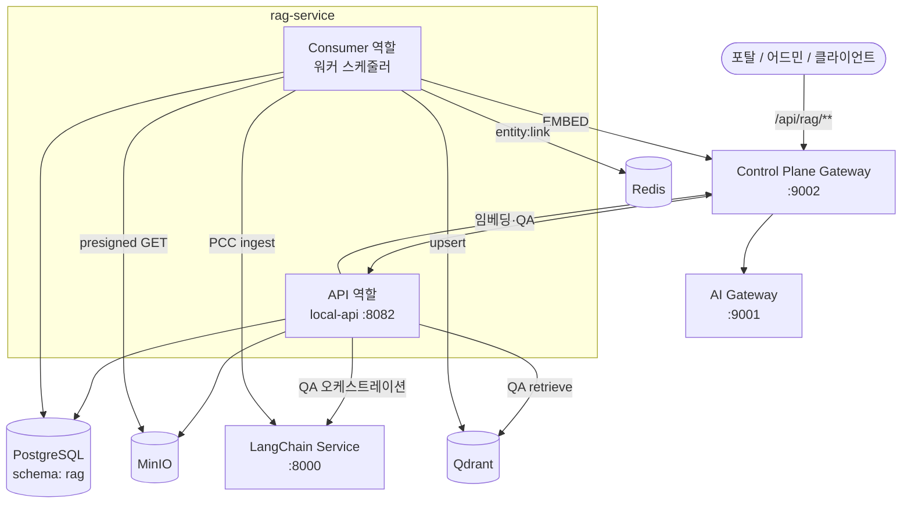

# rag-service

문서 업로드부터 청킹·임베딩·벡터 적재·그래프 추출까지 처리하고, 문서 기반 QA를 제공하는 **RAG 스토리지 서비스**입니다.

같은 코드베이스를 **API**와 **Consumer** 두 역할로 기동합니다. 업로드·조회·QA는 API가, 파이프라인 워커는 Consumer가 담당합니다.

GitLab / Harbor / GitOps 이미지명은 하위 호환을 위해 `rag-storage-service` 를 유지합니다.

---

## 목차

- [서비스 목적 및 핵심 기능](#서비스-목적-및-핵심-기능)
- [기술 스택](#기술-스택)
- [역할 분리 (API / Consumer)](#역할-분리-api--consumer)
- [서비스 구조도](#서비스-구조도)
- [인제스트 파이프라인](#인제스트-파이프라인)
- [API 엔드포인트](#api-엔드포인트)
- [로컬 실행 가이드](#로컬-실행-가이드)
- [프로파일](#프로파일)
- [문서](#문서)
- [CI/CD](#cicd)

---

## 서비스 목적 및 핵심 기능

### 목적

포탈·어드민에서 올린 문서를 MinIO에 저장하고, LangChain PCC(Parse·Clean·Chunk)와 AI Gateway 임베딩을 거쳐 Qdrant에 색인합니다. 질의 시 벡터 검색과 Graph RAG를 결합해 citation과 함께 답을 반환합니다.

외부 클라이언트는 **Control Plane Gateway** (`/api/rag/**`) 를 통해 호출합니다. RAG는 AI Gateway를 직접 호출하지 않고 Gateway(`GATEWAY_URL`)를 경유합니다.

### 핵심 기능

| 기능 | 설명 |
|------|------|
| **문서 업로드** | multipart 업로드 → MinIO 원본 저장 → 파이프라인 Job 생성 |
| **비동기 인제스트** | Consumer가 PCC / 엔티티 추출 → 임베딩 → Qdrant upsert → 관계 추출 |
| **개인 / 사내 RAG** | `RAG_PERSONAL_CATEGORY_ID` 기준 개인 문서 vs 카테고리 스코프 사내 문서 |
| **문서 기반 QA** | retrieve(벡터 + 그래프 RRF) → Gateway → AI Gateway `/qa` → citation 저장 |
| **Graph RAG** | Pass1 엔티티 추출, Pass2 관계 추출, 검색 시 그래프 traverse + 벡터 융합 |
| **파이프라인 폴링** | Job 상태·진행률·processingStatus 조회 |
| **카테고리 / 데이터소스 관리** | 포탈·어드민 문서·카테고리 CRUD, 재색인 |
| **관찰성** | Actuator health, Prometheus 메트릭 |

---

## 기술 스택

### Core

| 분류 | 기술 | 버전 |
|------|------|------|
| Language | Java | 17 |
| Framework | Spring Boot (MVC + WebFlux WebClient) | 3.4.2 |
| Build | Gradle | 8.14 |
| ORM | Spring Data JPA + QueryDSL | 5.1.0 |

### 인프라 · 연동

| 분류 | 기술 | 용도 |
|------|------|------|
| DB | PostgreSQL (`rag` 스키마) | 문서·Job·청크 메타·citation |
| Object Storage | MinIO | 원본 파일, PCC용 presigned URL |
| Vector DB | Qdrant | 청크 임베딩 검색 |
| Cache | Redis | Graph entity:link 캐시 (Consumer) |
| PCC / Chunk | LangChain Service | parse·clean·chunk, QA 오케스트레이션 보조 |
| Embedding / QA LLM | Control Plane Gateway → AI Gateway | 임베딩 요청, QA 답변 |

### 문서 처리

| 분류 | 기술 |
|------|------|
| PDF | Apache PDFBox |
| Office | Apache POI (ooxml) |

### 관찰성 · 기타

| 분류 | 기술 |
|------|------|
| Metrics | Micrometer + Prometheus (`/actuator/prometheus`) |
| Health | Spring Actuator (`/actuator/health`) |
| 코드 생성 | Lombok |
| 컨테이너 | Docker (multi-stage, eclipse-temurin:17) |
| CI/CD | GitLab CI + Kaniko + Harbor + GitOps |

---

## 역할 분리 (API / Consumer)

`rag.app.role` 으로 빈이 갈라집니다. **API만 켜면 인제스트가 진행되지 않습니다.**

| 역할 | 프로파일 | 포트 | 하는 일 |
|------|----------|------|---------|
| **api** | `local-api`, `dev-api` | local `8082` / dev `8080` | 업로드, 문서·카테고리, Job 조회, QA |
| **consumer** | `local-consumer`, `dev-consumer` | `0` (HTTP 없음) | PCC/엔티티 → EMBED → UPSERT → 관계 추출, stuck Job 복구 |

로컬에서 둘 다 띄울 때는 **Consumer를 먼저**, 이어서 API를 기동하는 것을 권장합니다.

---

## 서비스 구조도



### 요청 처리 흐름

```
업로드
  클라이언트 → Gateway → API
    ├─ MinIO 원본 저장
    ├─ rag_documents / rag_document_files / Job 생성 (PENDING)
    └─ 응답: documentId, fileId, jobId

인제스트 (Consumer, 틱마다 pick)
  EXTRACT_ENTITY 또는 PCC
    → LangChain parse/clean/chunk
  EMBED
    → Gateway /api/ai/{svc}/embedding/request
  UPSERT
    → Qdrant points
  EXTRACT_RELATION  (rag.graph.enabled=true)
    → LLM 관계 추출, 그래프 적재

QA
  클라이언트 → Gateway → API POST /api/rag/{svc}/qa
    ├─ 질문 임베딩 (Gateway)
    ├─ Qdrant 검색 + Graph traverse (RRF)
    ├─ Gateway → AI Gateway /qa → LangChain 컨텍스트
    └─ citation DB 저장 후 답변 반환
```

---

## 인제스트 파이프라인

Job 단계 (`RagJobStep`):

| 단계 | 담당 | 설명 |
|------|------|------|
| `EXTRACT_ENTITY` | `RagGraphEntityWorker` | Graph 활성 시 PCC를 대체. 엔티티 추출 + 청킹 |
| `PCC` | `RagPccWorker` | LangChain `POST /api/internal/rag/pcc/ingest` (graph off 시) |
| `EMBED` | `RagEmbedWorker` | Gateway 경유 임베딩 |
| `UPSERT` | `RagUpsertWorker` | Qdrant 적재 |
| `EXTRACT_RELATION` | `RagGraphWorker` | Graph Pass2 관계 추출 |

UI 표시용 `processingStatus`: `PROCESSING` / `SUCCEEDED` / `FAILED`. 업로드 직후 진행은 문서 목록이 아니라 `GET /api/rag/pipeline/jobs/{jobId}` 폴링을 권장합니다.

청킹 기본값은 semantic 모드입니다 (`rag.chunk.mode=SEMANTIC`, `max-chars=1200`).

---

## API 엔드포인트

문서·카테고리·파이프라인·QA API는 `rag.app.role=api` 일 때만 노출됩니다.

### 공통 헤더

| 헤더 | 필수 | 설명 |
|------|------|------|
| `X-User-No` | 포탈 문서·업로드·QA | 사용자 UUID |
| `X-Transaction-Id` | 업로드·QA | 요청 추적 UUID |
| `X-API-Key` | QA | 사용자 API 키 (UAK) |

`categoryId`가 비어 있거나 `RAG_PERSONAL_CATEGORY_ID`와 같으면 **개인 RAG**, 그 외 활성 카테고리는 **사내 RAG**입니다.

### 업로드 · QA

| 메서드 | 경로 | 설명 |
|--------|------|------|
| GET | `/api/rag/upload-config` | 업로드 한도 조회 |
| POST | `/api/rag/{aiServiceName}/documents/upload` | 문서 업로드 (multipart) |
| POST | `/api/rag/{aiServiceName}/qa` | 문서 기반 QA |
| GET | `/api/rag/{aiServiceName}/qa/messages/{messageId}` | citation 조회 |

### 포탈 문서 · 카테고리

| 메서드 | 경로 | 설명 |
|--------|------|------|
| GET | `/api/rag/portal/documents` | 문서 목록 |
| GET | `/api/rag/portal/documents/{documentId}` | 문서 상세 |
| GET | `/api/rag/portal/documents/{documentId}/processing-detail` | 처리 상세 |
| GET | `/api/rag/portal/documents/{documentId}/download` | 다운로드 |
| DELETE | `/api/rag/portal/documents/{documentId}` | 삭제 |
| GET | `/api/rag/portal/categories` | 카테고리 목록 |

### 파이프라인

| 메서드 | 경로 | 설명 |
|--------|------|------|
| GET | `/api/rag/pipeline/jobs/{jobId}` | Job 상태 (폴링) |
| GET | `/api/rag/pipeline/transactions/{transactionId}/latest-job` | transaction 기준 최신 Job |
| GET | `/api/rag/pipeline/jobs/{jobId}/detail` | Job 상세 |
| GET | `/api/rag/pipeline/documents/{documentId}/jobs` | 문서별 Job 목록 |

### 어드민

| 메서드 | 경로 | 설명 |
|--------|------|------|
| CRUD | `/api/rag/admin/categories` | 카테고리 관리 (`/api/rag/categories` 별칭) |
| CRUD | `/api/rag/admin/datasources` | 데이터소스 (`/api/rag/knowledge/datasources` 별칭) |
| POST | `/api/rag/admin/datasources/{documentId}/reindex` | 재색인 |
| * | `/api/rag/admin/graph/**` | Graph 디버그·어휘 (`/api/rag/knowledge/graph` 별칭) |

### 헬스

| 메서드 | 경로 | 설명 |
|--------|------|------|
| GET | `/actuator/health` | 헬스 체크 |
| GET | `/actuator/prometheus` | Prometheus 메트릭 |
| GET | `/health` | 레거시 스토리지 헬스 |

상세 요청/응답은 [docs/api-spec.md](docs/api-spec.md) 를 참고하세요.

---

## 로컬 실행 가이드

### 사전 요구사항

- **Java 17**
- **Gradle Wrapper** (별도 설치 불필요)
- 접근 가능한 **PostgreSQL**, **MinIO**, **Qdrant**
- Consumer / Graph 사용 시 **Redis**
- QA·임베딩: **Control Plane Gateway** (`:9002`), **AI Gateway** (`:9001`)
- PCC: **LangChain Service** (`:8000`)

비밀번호·MinIO 키는 GitOps `common-secret.yaml` 정본을 터미널 환경변수로만 넣고, 레포에 커밋하지 마세요.

### 1. 클론

```bash
git clone <repository-url>
cd rag-service
```

### 2. 환경 변수

로컬 프로파일은 `application-local-api.yml` / `application-local-consumer.yml` 을 씁니다. 최소 예시 (PowerShell):

```powershell
$env:RAG_LOCAL_DATASOURCE_URL = "jdbc:postgresql://HOST:PORT/DB"
$env:RAG_LOCAL_DATASOURCE_USERNAME = "rag_user"
$env:RAG_LOCAL_DATASOURCE_PASSWORD = "__CHANGE_ME__"

$env:MINIO_END_POINT = "http://HOST:9900"
$env:MINIO_PUBLIC_URL = "https://minio.example.com"
$env:MINIO_ACCESS_KEY = "__CHANGE_ME__"
$env:MINIO_SECRET_KEY = "__CHANGE_ME__"
$env:MINIO_BUCKET = "rag"

$env:RAG_QDRANT_BASE_URL = "http://HOST:30633"
$env:RAG_QDRANT_COLLECTION = "rag_chunks"

$env:GATEWAY_URL = "http://localhost:9002"
$env:RAG_LANGCHAIN_BASE_URL = "http://localhost:8000"

# Consumer Redis
$env:REDIS_HOST = "HOST"
$env:REDIS_PORT = "6379"
$env:REDIS_DATABASE = "0"
$env:REDIS_PASSWORD = "__CHANGE_ME__"
```

LangChain만 Docker로 띄우려면:

```bash
docker compose -f docker-compose.local-e2e.yml up -d
```

전체 E2E 기동 순서·env 템플릿은 [docs/local-e2e-integration-runbook.md](docs/local-e2e-integration-runbook.md) 를 따릅니다.

### 3. 빌드

```bash
./gradlew build -x test
```

Windows: `.\gradlew.bat build -x test`

### 4. 실행

**Consumer (파이프라인):**

```bash
./gradlew bootRun --args='--spring.profiles.active=local-consumer'
```

**API (업로드·QA):**

```bash
./gradlew bootRun --args='--spring.profiles.active=local-api'
```

API는 **`http://localhost:8082`** 에서 기동됩니다.

### 5. 동작 확인

```bash
curl http://localhost:8082/actuator/health
```

업로드 후 Job 폴링:

```bash
curl http://localhost:8082/api/rag/pipeline/jobs/{jobId}
```

### 6. 테스트

```bash
./gradlew test
```

특정 테스트만:

```bash
./gradlew test --tests "com.ragservice.worker.langchain.PccLangchainBenchmarkTest"
```

---

## 프로파일

| 프로파일 | 역할 | 포트 | 용도 |
|----------|------|------|------|
| `local-api` | api | 8082 | 로컬 PC API |
| `local-consumer` | consumer | 0 | 로컬 PC 워커 |
| `dev-api` | api | 8080 (`SERVER_PORT`) | K8s dev API |
| `dev-consumer` | consumer | 0 (`SERVER_PORT`) | K8s dev 워커 |

K8s는 GitOps `dev-config/rag-storage-service/values-api.yaml`, `values-consumer.yaml` 과 `SPRING_PROFILES_ACTIVE=dev-api|dev-consumer` 로 맞춥니다.

### 주요 환경 변수

| 변수 | 설명 |
|------|------|
| `GATEWAY_URL` | Control Plane Gateway. 임베딩·QA LLM은 여기만 사용. AI Gateway 직접 URL 금지 |
| `RAG_LANGCHAIN_BASE_URL` | LangChain QA 베이스 URL |
| `RAG_PCC_LANGCHAIN_BASE_URL` | PCC ingest 베이스 URL |
| `RAG_QDRANT_BASE_URL` / `RAG_QDRANT_COLLECTION` | Qdrant |
| `RAG_PERSONAL_CATEGORY_ID` | 개인 RAG 카테고리 UUID |
| `RAG_GRAPH_ENABLED` | Graph RAG on/off (기본 true) |
| `RAG_EMBEDDING_AI_SERVICE_NAME` | 임베딩 AI 서비스명 (기본 `openai`) |
| `RAG_UPLOAD_MAX_FILE_SIZE_BYTES` | 업로드 한도 (기본 20MB, local/dev API는 ~55MB) |

---

## 문서

| 문서 | 내용 |
|------|------|
| [docs/api-spec.md](docs/api-spec.md) | REST API 명세 |
| [docs/local-e2e-integration-runbook.md](docs/local-e2e-integration-runbook.md) | 로컬 E2E 기동 |
| [docs/RAG-Storage-LangChain-Integration.md](docs/RAG-Storage-LangChain-Integration.md) | PCC 연동 |
| [docs/graph-rag-design.md](docs/graph-rag-design.md) | Graph RAG 설계 |
| [docs/ai-connect-qa-orchestration-spec.md](docs/ai-connect-qa-orchestration-spec.md) | QA 오케스트레이션 |
| [docs/semantic-chunking-design.md](docs/semantic-chunking-design.md) | 시맨틱 청킹 |

---

## CI/CD

`.gitlab-ci.yml` 기준:

| 트리거 | 동작 |
|--------|------|
| `dev` 브랜치 | Harbor `rag/rag-storage-service:{short SHA}` 빌드 후 GitOps `dev-config/rag-storage-service/values-*.yaml` 태그 갱신 |
| `v*` 태그 | prod 이미지 빌드 후 GitOps prod 태그 갱신 |

로컬 Docker 이미지:

```bash
docker build -t rag-service:local .
```
