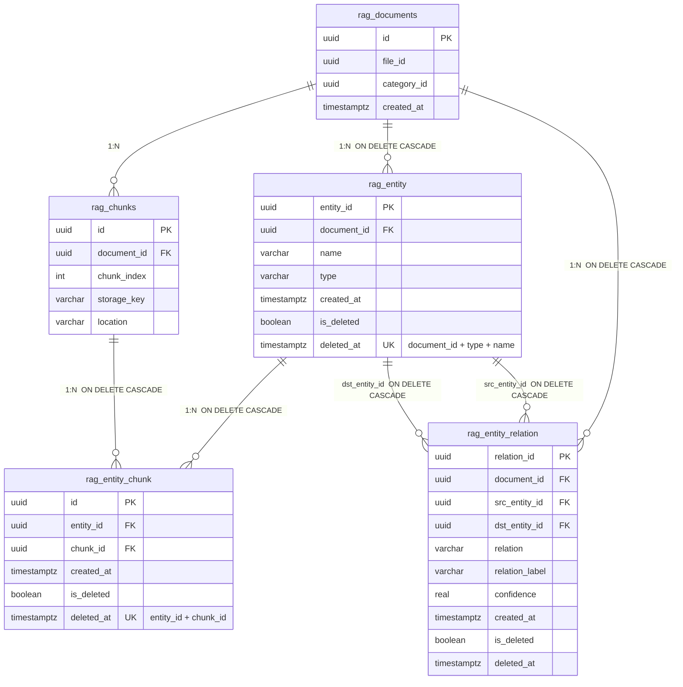

# Graph RAG 스키마 — 테이블 관계도

> **DDL**: [`graph-rag-schema.sql`](./graph-rag-schema.sql)  
> **설계 근거**: [`graph-rag-design.md`](./graph-rag-design.md) 5.2 / 5.3 / 6절  
> **적용 대상**: PostgreSQL schema `rag` (`ddl-auto: none`, Flyway 미사용 → 수동 적용)

---

## 한 줄 요약

Graph RAG는 기존 벡터 RAG 테이블(`rag_documents`, `rag_chunks`) 위에 **엔티티·관계·브리지** 3개 테이블을 추가한다. 문서 soft-delete 시 `is_deleted`/`deleted_at`으로 논리 삭제하고, purge(물리 삭제) 시 `ON DELETE CASCADE`로 연쇄 제거한다.

---

## 전체 ER 다이어그램



---

## 구조도 (ASCII)

```
                    ┌─────────────────────┐
                    │   rag_documents     │  ← 기존 (문서 루트)
                    │   PK: id            │
                    └──────────┬──────────┘
                               │
           ┌───────────────────┼───────────────────┐
           │ CASCADE           │ CASCADE           │ (기존, 논리 FK)
           ▼                   ▼                   ▼
┌──────────────────┐  ┌──────────────────┐  ┌──────────────────┐
│   rag_entity     │  │rag_entity_relation│  │   rag_chunks     │  ← 기존
│ PK: entity_id    │  │ PK: relation_id   │  │ PK: id           │
│ FK: document_id  │  │ FK: document_id   │  │ FK: document_id  │
│ UK: doc+type+name│  │ FK: src_entity_id │  │ UK: doc+index    │
└────────┬─────────┘  │ FK: dst_entity_id │  └────────┬─────────┘
         │            └─────────┬─────────┘           │
         │         src/dst ─────┘                      │
         │         (self via rag_entity)               │
         │                                             │
         └──────────────┬──────────────────────────────┘
                        ▼
              ┌──────────────────┐
              │ rag_entity_chunk │  ← 브리지 (그래프 ↔ 청크 ↔ 벡터)
              │ PK: id           │
              │ FK: entity_id    │
              │ FK: chunk_id     │
              │ UK: entity+chunk │
              └──────────────────┘
```

---

## 테이블 역할

| 테이블 | 역할 | 채우는 시점 |
|--------|------|-------------|
| `rag_entity` | 문서 내 **개념(노드)** — canonical 이름·타입 | Pass1 (`EXTRACT_ENTITY`) |
| `rag_entity_relation` | 엔티티 간 **관계(엣지)** — 방향성 저장, 탐색은 양방향 쿼리 | Pass2 (`EXTRACT_RELATION`) |
| `rag_entity_chunk` | **브리지** — 그래프 탐색 결과를 청크·벡터·citation으로 환원 | Pass2 |

---

## 외래키 관계

| 부모 | 자식 | FK 컬럼 | ON DELETE | 비고 |
|------|------|---------|-----------|------|
| `rag_documents` | `rag_entity` | `document_id → id` | CASCADE | 신규 |
| `rag_documents` | `rag_entity_relation` | `document_id → id` | CASCADE | 신규 |
| `rag_entity` | `rag_entity_relation` | `src_entity_id → entity_id` | CASCADE | 신규 |
| `rag_entity` | `rag_entity_relation` | `dst_entity_id → entity_id` | CASCADE | 신규 |
| `rag_entity` | `rag_entity_chunk` | `entity_id → entity_id` | CASCADE | 신규 |
| `rag_chunks` | `rag_entity_chunk` | `chunk_id → id` | CASCADE | 신규 |
| `rag_documents` | `rag_chunks` | `document_id` | — | 기존 (논리 FK) |

---

## 삭제 연쇄 (CASCADE)

`rag_documents` 한 건이 삭제되면 아래 순서로 그래프 데이터가 정리된다.

```
rag_documents (삭제)
    ├── rag_entity              (CASCADE via document_id)
    │       ├── rag_entity_relation  (CASCADE via src/dst_entity_id)
    │       └── rag_entity_chunk     (CASCADE via entity_id)
    └── rag_entity_relation     (CASCADE via document_id)
```

`rag_chunks` 삭제 시 해당 청크에 연결된 `rag_entity_chunk` 행만 CASCADE로 제거된다. 엔티티·관계는 유지된다.

---

## 소프트 삭제 (`is_deleted` / `deleted_at`)

3개 신규 테이블 모두 `rag_documents`·`rag_categories`와 동일한 패턴을 따른다.

| 컬럼 | 타입 | 기본값 | 설명 |
|------|------|--------|------|
| `is_deleted` | `boolean` | `false` | 소프트 삭제 여부 |
| `deleted_at` | `timestamptz` | `null` | 삭제 시각 (`is_deleted=true`일 때 기록) |

### 삭제 단계별 동작

| 시점 | DB 동작 | 그래프 테이블 |
|------|---------|---------------|
| 문서 soft-delete | `rag_documents.is_deleted=true` | 앱에서 연쇄 soft-delete (`is_deleted=true`, `deleted_at` 기록) |
| 그래프 탐색·조회 | `is_deleted=false`만 대상 | 삭제된 행은 탐색·citation에서 제외 |
| 문서 purge (물리 삭제) | `rag_documents` 행 DELETE | FK `ON DELETE CASCADE`로 그래프 행 **물리 삭제** |

> **CASCADE vs 소프트 삭제**: FK CASCADE는 **행이 실제로 DELETE될 때**만 동작한다. 문서 soft-delete 시에는 앱 레이어에서 그래프 3테이블을 함께 soft-delete해야 한다.

---

## 테이블 상세

### 1) `rag_entity` — 엔티티(개념)

Pass1이 문서 단위로 canonical 이름을 확정한다.

| 컬럼 | 타입 | 제약 | 설명 |
|------|------|------|------|
| `entity_id` | `uuid` | PK | 엔티티 ID |
| `document_id` | `uuid` | FK, NOT NULL | 소속 문서 |
| `name` | `varchar(512)` | NOT NULL | canonical 이름 (예: `환불정책`) |
| `type` | `varchar(64)` | NOT NULL | 닫힌 TYPE 이름 (`rag_graph_vocab_entry` kind=`TYPE`, 예: `ORGANIZATION`, `POLICY`, …) |
| `created_at` | `timestamptz` | NOT NULL, DEFAULT `now()` | 생성 시각 |
| `is_deleted` | `boolean` | NOT NULL, DEFAULT `false` | 소프트 삭제 여부 |
| `deleted_at` | `timestamptz` | nullable | 삭제 시각 |

**유니크**: `(document_id, type, name)` — 문서 내 동일 타입·이름 중복 방지

**인덱스**: `document_id`, `name`

---

### 2) `rag_entity_relation` — 엔티티 간 관계

Pass2가 채운다. 방향은 상위→하위 등 **한 방향**으로만 저장하고, 탐색 시 양방향 쿼리한다 (설계 7절).

| 컬럼 | 타입 | 제약 | 설명 |
|------|------|------|------|
| `relation_id` | `uuid` | PK | 관계 ID |
| `document_id` | `uuid` | FK, NOT NULL | 소속 문서 |
| `src_entity_id` | `uuid` | FK, NOT NULL | 출발 엔티티 |
| `dst_entity_id` | `uuid` | FK, NOT NULL | 도착 엔티티 |
| `relation` | `varchar(64)` | NOT NULL | 정규 RELATION 이름 (`rag_graph_vocab_entry` kind=`RELATION`, 예: `HAS`, `EXCEPTION_OF`, … 세트 밖은 `RELATED_TO` fallback) |
| `relation_label` | `varchar(512)` | nullable | LLM 원문 라벨 (예: `환불 불가 예외`) |
| `confidence` | `real` | nullable | 신뢰도 0.0 ~ 1.0 |
| `created_at` | `timestamptz` | NOT NULL, DEFAULT `now()` | 생성 시각 |
| `is_deleted` | `boolean` | NOT NULL, DEFAULT `false` | 소프트 삭제 여부 |
| `deleted_at` | `timestamptz` | nullable | 삭제 시각 |

**인덱스**: `src_entity_id`, `dst_entity_id`, `document_id`

---

### 3) `rag_entity_chunk` — 브리지 (그래프 ↔ 청크 ↔ 벡터)

그래프 탐색으로 찾은 엔티티를 실제 청크·벡터·citation으로 연결한다.

| 컬럼 | 타입 | 제약 | 설명 |
|------|------|------|------|
| `id` | `uuid` | PK | 브리지 행 ID |
| `entity_id` | `uuid` | FK, NOT NULL | 연결 엔티티 |
| `chunk_id` | `uuid` | FK, NOT NULL | 연결 청크 (`rag_chunks.id`) |
| `created_at` | `timestamptz` | NOT NULL, DEFAULT `now()` | 생성 시각 |
| `is_deleted` | `boolean` | NOT NULL, DEFAULT `false` | 소프트 삭제 여부 |
| `deleted_at` | `timestamptz` | nullable | 삭제 시각 |

**유니크**: `(entity_id, chunk_id)` — 동일 엔티티·청크 쌍 중복 방지

**인덱스**: `entity_id`, `chunk_id`

---

### 4) `rag_graph_vocab_entry` — TYPE/RELATION 닫힌 어휘 (admin)

Java enum 대신 DB로 관리하는 전역 어휘 세트. Pass1/Pass2 프롬프트 주입·정규화의 단일 소스.

| 컬럼 | 타입 | 제약 | 설명 |
|------|------|------|------|
| `id` | `bigint` | PK, identity | |
| `kind` | `varchar(10)` | NOT NULL | `TYPE` 또는 `RELATION` |
| `name` | `varchar(100)` | NOT NULL | 어휘 이름 (예: `WORK`, `LOCATED_IN`) |
| `is_builtin` | `boolean` | NOT NULL | 초기 seed 대상 (기동 시 `ensureBuiltins`) |
| `is_active` | `boolean` | NOT NULL | 비활성 시 프롬프트·정규화 세트에서 제외 |
| `is_deleted` | `boolean` | NOT NULL | soft-delete |
| `deleted_at` | `timestamptz` | nullable | 삭제 시각 |
| `sort_order` | `int` | NOT NULL | 목록 정렬 |
| `created_at` | `timestamptz` | NOT NULL, DEFAULT `now()` | |

**유니크**: `(kind, name)`

**기본 fallback**(코드): TYPE→`CONCEPT`, RELATION→`RELATED_TO`

---

## 데이터 흐름 (인덱싱 → 조회)

```
[인덱싱]
PARSE → CLEAN → EXTRACT_ENTITY(Pass1) → CHUNK → EMBED → UPSERT → EXTRACT_RELATION(Pass2)
                    │                                              │
                    ▼                                              ▼
              rag_entity                              rag_entity_relation
                                                              rag_entity_chunk

[조회]
질문 → Qdrant 벡터검색 + PostgreSQL 그래프 탐색
         │                        │
         └──── RRF 융합 ──────────┘
                    │
                    ▼
         rag_entity_chunk JOIN rag_chunks → citations[]
```

---

## 적용 방법

```bash
psql -h <host> -U <user> -d <db> -f docs/graph-rag-schema.sql
```

DDL은 `CREATE TABLE IF NOT EXISTS` / `CREATE INDEX IF NOT EXISTS` 이므로 **멱등**하게 재실행할 수 있다.
